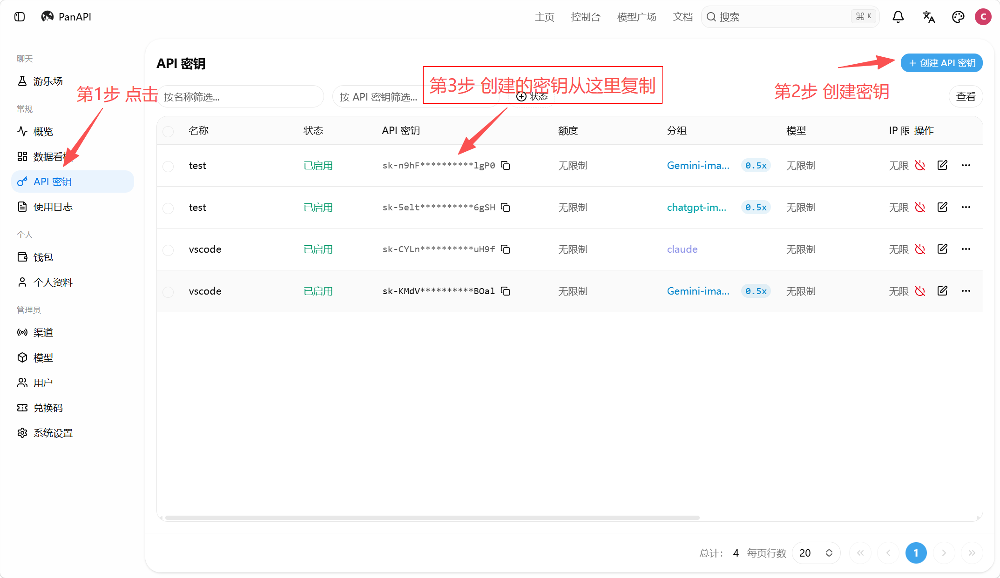
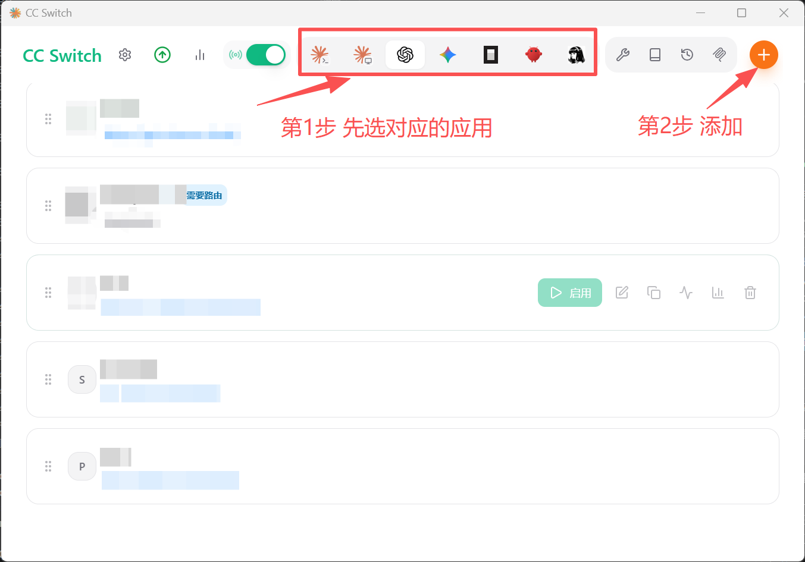
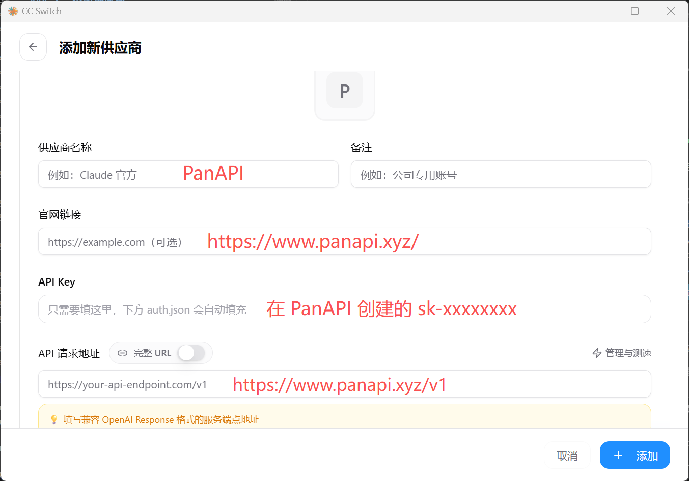

# PanAPI 接入配置教程

本文参考适用于通过 PanAPI 为 ChatGPT/Codex 桌面端、Claude Desktop 和 Cursor 配置第三方 API。

> PanAPI 官网：<https://www.panapi.xyz/>

## 一、准备工作

### 1. 注册并获取 API Key

1. 打开 <https://www.panapi.xyz/> 并登录账号。
2. 按站内说明充值或兑换额度。
3. 进入令牌/API Key 管理页面，新建一个令牌。
4. 保存生成的密钥，通常形如 `sk-xxxxxxxx`。



请勿把 API Key 发给他人，也不要提交到公开代码仓库。

### 2. 接入地址

| 配置项 | 地址 |
| --- | --- |
| 官网地址/Base URL | `https://www.panapi.xyz/` |
| OpenAI 兼容 API 地址 | `https://www.panapi.xyz/v1` |

模型名称应以 PanAPI 的模型广场或控制台实际显示为准，不要直接照抄示例模型名。

## 二、ChatGPT/Codex 桌面端接入

原教程推荐使用 CC Switch 管理第三方供应商配置。

### 1. 安装客户端和 CC Switch

- ChatGPT/Codex 桌面端：<https://chatgpt.com/codex>
- Windows 也可在 Microsoft Store 搜索并安装 ChatGPT。
- CC Switch 下载：<https://github.com/farion1231/cc-switch/releases>

### 2. 添加供应商

1. 打开 CC Switch，切换到 ChatGPT/Codex 配置区域。
2. 点击加号，选择“添加新供应商”。




3. 填写以下内容：

| 配置项 | 填写内容 |
| --- | --- |
| 供应商名称 | `PanAPI`，或任意便于识别的名称 |
| API Key | 在 PanAPI 创建的 `sk-xxxxxxxx` |
| 官网链接 | `https://www.panapi.xyz/` |
| 请求地址 URL | `https://www.panapi.xyz/v1` |
| 模型 | 填写 PanAPI 控制台中可用的准确模型名 |

4. 点击“添加”或“保存”。
5. 启用刚添加的供应商。
6. 完全退出并重新打开 ChatGPT/Codex 桌面端，然后发起一次简单对话测试。

### 3. 可选：启用图片生成

只有当 PanAPI 当前令牌和所选模型支持图片生成时，才需要开启此项。

在 CC Switch 的 `config.toml` 配置中确认或添加：

```toml
requires_openai_auth = false
http_headers = { "x-openai-actor-authorization" = "codex-compatible-image-generation" }

[features]
image_generation = true
```

如果文件中已经存在 `[features]`，只在该区块下增加 `image_generation = true`，不要重复创建同名区块。

## 三、Claude Desktop 接入

### 1. 安装

- Claude Desktop：<https://claude.com/download>
- CC Switch：<https://github.com/farion1231/cc-switch/releases>

### 2. 配置

1. 打开 CC Switch，进入 Claude 配置区域。
2. 点击加号添加供应商。
3. 供应商名称填写 `PanAPI`。
4. API Key 填写 PanAPI 生成的 `sk-xxxxxxxx`。
5. 官网链接填写 `https://www.panapi.xyz/`。
6. API 请求地址填写 `https://www.panapi.xyz/v1`。
7. 按 PanAPI 提供的模型名称设置模型映射。
8. 保存并启用配置，然后完全退出并重新打开 Claude Desktop。

> 注意：Claude Desktop 所需协议可能与 OpenAI 兼容协议不同。请先确认 PanAPI 是否明确支持 Claude/Anthropic 兼容接入；如果仅支持 OpenAI 兼容接口，则不能仅靠替换 URL 保证 Claude Desktop 可用。

## 四、Cursor 接入

原教程使用 Cursor BYOK 助手来切换自定义 API：

- 下载地址：<https://github.com/leookun/cursor-byok/releases>

### 配置步骤

1. 安装并启动 Cursor BYOK 助手。
2. 打开 Cursor，确认没有启用会强制直连官方服务的选项。
3. 在模型配置中新增模型，填写：

| 配置项 | 填写内容 |
| --- | --- |
| 显示名称 | 任意名称，例如 `PanAPI GPT` |
| 访问密钥 | PanAPI 生成的 `sk-xxxxxxxx` |
| 接口地址 | `https://www.panapi.xyz/v1` |
| 模型标识 | PanAPI 控制台中的准确模型名 |
| 接口端点 | 通常为 `/v1/chat/completions`，以工具和 PanAPI 实际要求为准 |

4. 保存并测试配置。
5. 返回 Cursor，新建一个对话并选择刚添加的模型。

官方模型对话和本地 BYOK 模型对话的上下文通常不能互相续接，切换后请新建对话。

## 五、连通性测试

可使用下面的 OpenAI 兼容请求进行基础测试。请将模型名和 API Key 替换为自己的实际值。

```bash
curl https://www.panapi.xyz/v1/chat/completions \
  -H "Authorization: Bearer sk-xxxxxxxx" \
  -H "Content-Type: application/json" \
  -d '{
    "model": "你的模型名称",
    "messages": [
      {"role": "user", "content": "你好，请回复：连接成功"}
    ]
  }'
```

Windows PowerShell 示例：

```powershell
$headers = @{
  Authorization = "Bearer sk-xxxxxxxx"
  "Content-Type" = "application/json"
}

$body = @{
  model = "你的模型名称"
  messages = @(
    @{ role = "user"; content = "你好，请回复：连接成功" }
  )
} | ConvertTo-Json -Depth 5

Invoke-RestMethod `
  -Uri "https://www.panapi.xyz/v1/chat/completions" `
  -Method Post `
  -Headers $headers `
  -Body $body
```

## 六、常见问题

### 返回 401 或 Unauthorized

- 检查 API Key 是否完整，前后不要带空格。
- 确认请求头格式为 `Authorization: Bearer sk-xxxxxxxx`。
- 检查令牌是否启用、过期或被删除。

### 返回 404

- 确认请求地址包含 `/v1`。
- 对话接口通常是 `/v1/chat/completions`。
- 检查客户端是否自动重复拼接了 `/v1`。

### 返回模型不存在或无权限

- 复制 PanAPI 模型广场或控制台中的准确模型标识。
- 确认当前令牌有权访问该模型或分组。
- 不要把客户端中的显示名称当作模型标识。

### 客户端仍然走官方接口

- 确认 CC Switch 中已经启用 PanAPI 供应商。
- 完全退出客户端后重新打开。
- 检查客户端或辅助工具中是否开启了“直连官方”等选项。

### 请求地址应不应该带结尾斜杠

建议官网地址写成 `https://www.panapi.xyz/`，API Base URL 写成 `https://www.panapi.xyz/v1`。如果客户端会自行拼接路径，避免填成 `/v1/v1`。

## 七、安全建议

- 为不同客户端分别创建令牌，便于单独停用和统计用量。
- 设置合理的额度或用量限制。
- 不要在截图、日志、聊天记录或公开仓库中暴露完整 API Key。
- 怀疑密钥泄露时，立即删除旧令牌并创建新令牌。
